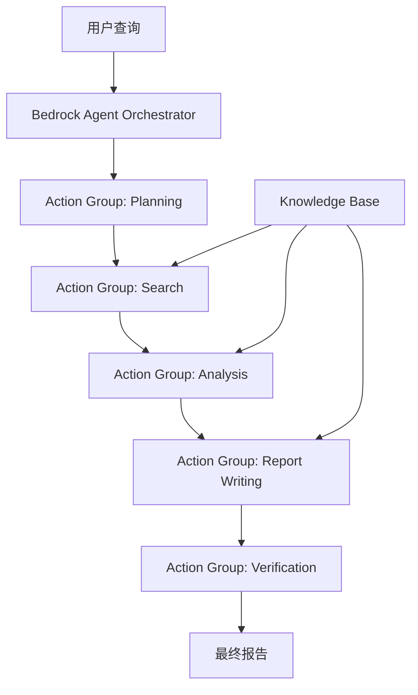

# Financial Research Agent - AWS Bedrock 实现

本项目展示了如何使用AWS Bedrock Agent实现一个金融研究代理系统，该系统可以根据用户的查询生成详细的金融分析报告。

## 架构概述

该系统使用AWS Bedrock Agent作为核心，通过多个Action Groups实现不同的功能模块，类似于原始OpenAI实现中的多代理系统。



## 组件说明

1. **Bedrock Agent**: 作为整体协调者，管理整个流程
2. **Action Groups**:
   - **Planning**: 规划搜索策略
   - **Search**: 执行网络搜索和知识库检索
   - **Analysis**: 包含财务分析和风险分析功能
   - **Report Writing**: 撰写报告
   - **Verification**: 验证报告的准确性和一致性
3. **Knowledge Base**: 存储和检索相关的金融信息
4. **Lambda Functions**: 实现各个Action Group的功能
5. **API Gateway**: 提供REST API接口
6. **前端界面**: 用户交互界面

## 目录结构

```
financial_research_agent-bedrock/
├── README.md                     # 项目说明文档
├── cdk/                          # AWS CDK代码
│   ├── app.py                    # CDK应用入口
│   ├── financial_research_stack.py  # CDK堆栈定义
│   └── requirements.txt          # CDK依赖
├── lambdas/                      # Lambda函数代码
│   ├── orchestrator/             # 主协调Lambda
│   ├── planning/                 # 规划搜索Lambda
│   ├── search/                   # 搜索Lambda
│   ├── analysis/                 # 分析Lambda
│   ├── report/                   # 报告生成Lambda
│   └── verification/             # 验证Lambda
└── frontend/                     # 前端代码
    ├── index.html                # 主页面
    ├── styles.css                # 样式表
    └── script.js                 # 前端脚本
```

## 详细配置和部署步骤

### 1. 设置AWS环境

#### 1.1 安装必要的工具

```bash
# 安装AWS CLI
curl "https://awscli.amazonaws.com/awscli-exe-linux-x86_64.zip" -o "awscliv2.zip"
unzip awscliv2.zip
sudo ./aws/install

# 安装AWS CDK
npm install -g aws-cdk
```

#### 1.2 配置AWS凭证

```bash
aws configure
# 输入您的AWS Access Key ID、Secret Access Key、默认区域和输出格式
```

#### 1.3 启用AWS Bedrock服务

1. 登录AWS管理控制台
2. 导航到AWS Bedrock服务
3. 点击"模型访问"
4. 请求访问Claude和Titan模型
5. 等待访问请求获得批准

### 2. 设置IAM权限

#### 2.1 创建Bedrock服务角色

1. 登录AWS管理控制台
2. 导航到IAM服务
3. 创建一个新角色，选择"AWS服务"作为可信实体类型
4. 选择"Bedrock"作为使用此角色的服务
5. 附加以下策略：
   - `AmazonBedrockFullAccess`
   - `AmazonS3ReadOnlyAccess`（用于Knowledge Base访问）

#### 2.2 创建Lambda执行角色

1. 创建一个新角色，选择"AWS服务"作为可信实体类型
2. 选择"Lambda"作为使用此角色的服务
3. 附加以下策略：
   - `AWSLambdaBasicExecutionRole`
   - `AmazonBedrockFullAccess`
   - `AmazonS3ReadWriteAccess`

### 3. 创建和配置Knowledge Base

#### 3.1 准备数据源

1. 创建一个S3存储桶用于存储金融文档
```bash
aws s3 mb s3://financial-research-documents
```

2. 上传金融文档到S3存储桶
```bash
aws s3 cp financial_documents/ s3://financial-research-documents/ --recursive
```

#### 3.2 创建Knowledge Base

1. 登录AWS管理控制台
2. 导航到AWS Bedrock服务
3. 选择"Knowledge bases"
4. 点击"Create knowledge base"
5. 配置Knowledge Base：
   - 名称：`FinancialKnowledgeBase`
   - 数据源：选择您的S3存储桶
   - 嵌入模型：选择`amazon.titan-embed-text-v1`
   - 向量存储：选择默认选项
   - 服务角色：选择之前创建的Bedrock服务角色

#### 3.3 索引数据

1. 创建Knowledge Base后，点击"Sync"按钮开始索引数据
2. 等待索引完成（这可能需要一些时间，取决于文档数量和大小）

### 4. 部署Lambda函数

#### 4.1 准备Lambda层

1. 创建Lambda层目录结构
```bash
mkdir -p lambdas/layer/python
```

2. 安装依赖到层目录
```bash
pip install -r lambdas/layer/requirements.txt -t lambdas/layer/python/
```

#### 4.2 使用CDK部署Lambda函数

1. 安装CDK依赖
```bash
cd cdk
pip install -r requirements.txt
```

2. 引导CDK环境（如果是首次使用CDK）
```bash
cdk bootstrap
```

3. 部署CDK堆栈
```bash
cdk deploy
```

### 5. 创建和配置Bedrock Agent

#### 5.1 创建Agent

1. 登录AWS管理控制台
2. 导航到AWS Bedrock服务
3. 选择"Agents"
4. 点击"Create agent"
5. 配置Agent：
   - 名称：`FinancialResearchAgent`
   - 模型：选择`anthropic.claude-3-sonnet-20240229-v1:0`
   - 指令：输入以下指令
     ```
     你是一个金融研究助手，专门分析公司财务状况、行业趋势和市场动态。你可以回答有关公司财务表现、风险分析和投资机会的问题。
     ```
   - 服务角色：选择之前创建的Bedrock服务角色

#### 5.2 添加Knowledge Base

1. 在Agent配置页面，选择"Knowledge bases"选项卡
2. 点击"Add knowledge base"
3. 选择之前创建的`FinancialKnowledgeBase`
4. 配置检索设置（可使用默认值）

#### 5.3 创建Action Groups

1. 在Agent配置页面，选择"Action groups"选项卡
2. 点击"Add action group"
3. 为每个功能模块创建一个Action Group：
   - Planning Action Group
   - Search Action Group
   - Analysis Action Group
   - Report Action Group
   - Verification Action Group
4. 对于每个Action Group，配置API架构和Lambda函数

#### 5.4 创建Agent别名

1. 在Agent配置页面，选择"Aliases"选项卡
2. 点击"Create alias"
3. 配置别名：
   - 名称：`prod`
   - 版本：选择`DRAFT`

### 6. 配置API Gateway

#### 6.1 创建API

1. 登录AWS管理控制台
2. 导航到API Gateway服务
3. 点击"Create API"
4. 选择"REST API"
5. 配置API：
   - 名称：`FinancialResearchAPI`
   - 描述：`API for Financial Research Agent`

#### 6.2 创建资源和方法

1. 创建一个新资源：`/research`
2. 为该资源添加POST方法
3. 集成类型选择"Lambda函数"
4. 选择之前部署的Orchestrator Lambda函数
5. 启用CORS

#### 6.3 部署API

1. 点击"Deploy API"
2. 创建一个新的阶段：`prod`
3. 记下API的调用URL

### 7. 部署前端界面

#### 7.1 更新API URL

1. 打开`frontend/script.js`文件
2. 将`API_URL`变量更新为您的API Gateway URL：
```javascript
const API_URL = 'https://your-api-gateway-id.execute-api.your-region.amazonaws.com/prod/research';
```

#### 7.2 部署前端

1. 创建一个S3存储桶用于托管前端
```bash
aws s3 mb s3://financial-research-frontend
```

2. 启用S3存储桶的静态网站托管
```bash
aws s3 website s3://financial-research-frontend --index-document index.html
```

3. 上传前端文件
```bash
aws s3 cp frontend/ s3://financial-research-frontend/ --recursive
```

4. 设置存储桶策略以允许公共访问
```bash
aws s3api put-bucket-policy --bucket financial-research-frontend --policy file://bucket-policy.json
```

bucket-policy.json:
```json
{
  "Version": "2012-10-17",
  "Statement": [
    {
      "Sid": "PublicReadGetObject",
      "Effect": "Allow",
      "Principal": "*",
      "Action": "s3:GetObject",
      "Resource": "arn:aws:s3:::financial-research-frontend/*"
    }
  ]
}
```

5. 访问前端网站
```
http://financial-research-frontend.s3-website-your-region.amazonaws.com
```

### 8. 测试系统

1. 访问前端网站
2. 输入金融研究查询，例如："分析苹果公司最近一个季度的表现"
3. 点击"开始研究"按钮
4. 等待系统处理请求并显示结果

### 9. 监控和故障排除

#### 9.1 查看Lambda日志

```bash
aws logs filter-log-events --log-group-name /aws/lambda/FinancialResearchStack-OrchestratorLambda
```

#### 9.2 监控Bedrock Agent

1. 登录AWS管理控制台
2. 导航到AWS Bedrock服务
3. 选择"Agents"
4. 点击您的Agent
5. 选择"Monitoring"选项卡查看使用情况和错误

#### 9.3 常见问题排查

- **Lambda超时**：增加Lambda函数的超时设置
- **权限错误**：检查IAM角色和策略
- **Knowledge Base检索失败**：确保文档已正确索引
- **API Gateway错误**：检查API配置和CORS设置

## 使用方法

### 云端部署

1. 部署整个系统后，访问前端界面
2. 输入金融研究查询，例如："分析苹果公司最近一个季度的表现"
3. 系统将执行以下步骤：
   - 规划搜索策略
   - 执行搜索
   - 分析搜索结果
   - 生成报告
   - 验证报告
4. 最终返回一份详细的金融分析报告

### 本地部署和测试

本项目提供了一键部署和本地测试的功能，可以在本地机器上快速启动和测试系统。

#### 一键部署到AWS

```bash
# 赋予部署脚本执行权限
chmod +x deploy.sh

# 执行部署脚本
./deploy.sh
```

部署脚本会自动执行以下操作：
1. 安装必要的依赖
2. 配置AWS凭证（如果尚未配置）
3. 准备Lambda层
4. 部署CDK堆栈
5. 更新前端配置
6. 启动本地前端服务器

#### 本地测试

```bash
# 赋予启动脚本执行权限
chmod +x start-local.sh

# 启动本地服务
./start-local.sh
```

或者使用npm脚本：

```bash
# 安装依赖
npm install

# 启动本地服务
npm run local
```

启动后，可以通过以下URL访问系统：
- 前端界面：http://localhost:3000
- API端点：http://localhost:3000/research

#### 配置本地环境

在本地测试前，需要配置`config.local.json`文件：

```json
{
  "aws": {
    "region": "us-east-1",
    "bedrockModels": {
      "text": "anthropic.claude-3-sonnet-20240229-v1:0",
      "embedding": "amazon.titan-embed-text-v1"
    }
  },
  "api": {
    "localPort": 3000,
    "frontendPort": 8080
  },
  "search": {
    "apiKey": "YOUR_SEARCH_API_KEY",
    "engineId": "YOUR_SEARCH_ENGINE_ID"
  },
  "knowledgeBase": {
    "id": "YOUR_KNOWLEDGE_BASE_ID"
  }
}
```

请替换以下值：
- `YOUR_SEARCH_API_KEY`：搜索API密钥（例如Google Custom Search API）
- `YOUR_SEARCH_ENGINE_ID`：搜索引擎ID
- `YOUR_KNOWLEDGE_BASE_ID`：AWS Bedrock Knowledge Base ID（如果已创建）

## 优势与特点

1. **可扩展性**: AWS Bedrock Agent可以轻松扩展以处理更多请求
2. **集成性**: 与AWS生态系统无缝集成
3. **知识库支持**: 使用Knowledge Base存储和检索相关信息
4. **多模型支持**: 可以使用不同的基础模型，如Claude、Titan等
5. **成本效益**: 按使用量付费
6. **安全性**: 利用AWS的安全机制保护数据和API

## 与OpenAI实现的对比

| 特性 | OpenAI实现 | AWS Bedrock实现 |
|------|------------|----------------|
| 代理系统 | Agents SDK | Bedrock Agent |
| 子代理 | 多个Agent实例 | Action Groups |
| 搜索功能 | WebSearchTool | Lambda + 外部API |
| 知识库 | 无内置支持 | Bedrock Knowledge Base |
| 部署 | 本地或自托管 | AWS云服务 |
| 扩展性 | 需要自行管理 | AWS自动扩展 |
| 安全性 | 需要自行实现 | AWS IAM集成 |
