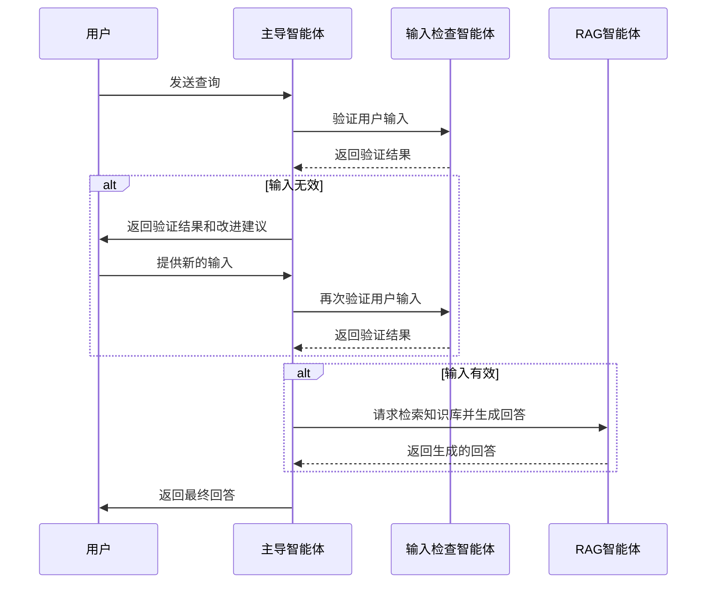
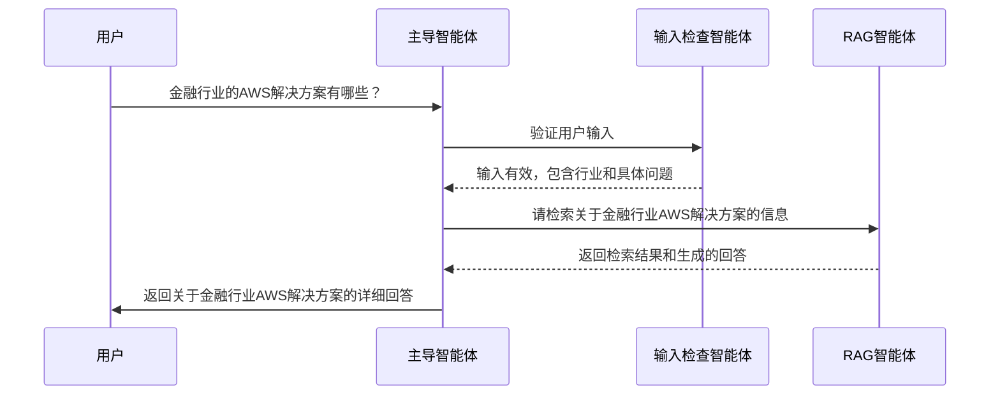

# RAG Agents

RAG Agents是一个基于multi-agent-orchestrator框架的多智能体RAG（检索增强生成）系统。该系统模拟了一个由主导智能体、输入检查智能体和RAG智能体组成的团队，用于处理用户查询、验证输入、检索知识库和生成回答。

## 业务需求

在当今信息爆炸的时代，企业面临以下关键挑战：

- **用户输入质量参差不齐**：用户提问往往不够明确或缺乏必要信息，导致系统难以提供准确回答
- **知识库检索精度问题**：传统RAG系统可能无法准确理解用户意图，导致检索结果不相关
- **回答质量与一致性**：生成的回答需要既准确又符合企业标准，同时避免编造不存在的信息
- **用户体验与交互流畅性**：系统需要引导用户提供更明确的输入，同时保持对话的自然流畅
- **知识边界认知**：系统需要明确知道自己知道什么和不知道什么，避免提供错误信息

## 解决方案

RAG Agents多智能体系统通过以下方式解决这些挑战：

- **输入检查智能体**：专门负责验证用户输入是否满足要求，并提供改进建议
- **RAG智能体**：专门负责检索知识库并生成准确、全面的回答
- **主导智能体**：协调各智能体工作，确保整个流程的顺畅和一致性
- **记忆系统**：存储用户查询历史、检索结果和验证结果，提供上下文支持
- **知识库检索工具**：提供高效、准确的知识检索能力

## 系统架构


## 智能体调用流程



RAG Agents系统包括以下组件：

1. **智能体**：
   - 输入检查智能体（InputVerifierAgent）：验证用户输入是否满足要求
   - RAG智能体（RAGAgent）：检索知识库并生成回答
   - 主导智能体（SupervisorAgent）：协调各智能体工作

2. **工具系统**：
   - 知识库检索工具：搜索知识库，检索与查询相关的内容
   - 输入验证工具：验证用户输入是否满足要求
   - 回答生成工具：基于检索结果生成回答

3. **记忆系统**：
   - 用户查询历史：存储用户的查询内容
   - 检索结果：存储知识库检索结果
   - 验证结果：存储输入验证结果

## 安装

1. 安装依赖项：

```bash
cd rag_agents
pip install -r requirements.txt
```

2. 设置环境变量：

创建一个`.env`文件，包含以下内容：

```
# AWS凭证（如果使用AWS Bedrock）
AWS_ACCESS_KEY_ID=your_access_key
AWS_SECRET_ACCESS_KEY=your_secret_key
AWS_REGION=your_region

# 可选：Anthropic API密钥（如果使用Anthropic Claude）
ANTHROPIC_API_KEY=your_anthropic_api_key
```

## 使用方法

运行主程序：

```bash
cd rag_agents
python -m main
```

系统启动后，您可以向系统提问关于AWS行业解决方案的问题，例如：

1. 金融行业的AWS解决方案有哪些？
2. AWS如何帮助零售行业实现数字化转型？
3. 游戏行业使用AWS有哪些优势？

### 交互示例：

以下是一个具体的交互示例，展示了用户询问"金融行业的AWS解决方案"时的系统处理流程：



## 自定义

您可以通过修改以下文件来自定义系统：

- `tools.py`：修改知识库内容或添加新的工具
- `agents.py`：调整智能体的系统提示或行为
- `memory.py`：修改记忆系统的结构或行为
- `main.py`：调整主程序逻辑或智能体配置

## 依赖项

- multi-agent-orchestrator：多智能体协调框架
- boto3：AWS SDK for Python（用于访问AWS Bedrock）
- python-dotenv：环境变量管理

## 注意事项

- 该系统需要访问AWS Bedrock或Anthropic API来使用LLM模型
- 系统中的知识库数据为示例数据，可以根据实际需求进行扩展
- 该系统可以根据实际业务需求进行定制和扩展
